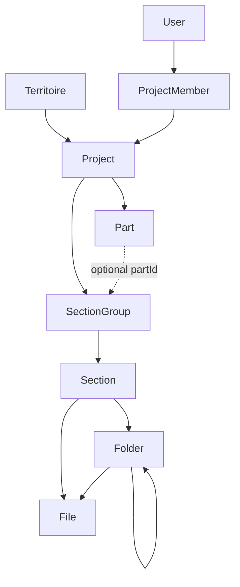

# Foundation rebuild — phased plan

## Final simplifications (approved)

1. No `partId` on File — derive via Section → SectionGroup → Part.
2. No `projectId` on Section — derive via SectionGroup.
3. No `projectId` on Folder — derive via Section; same-section parent enforced in app (+ composite FK if easy).
4. Territoire identity: **`code` only** (drop slug). Rationale: `/territoires/[code]` already exists; keeping code avoids a route rename for no UX gain. Project/Part keep slug.
5. Section.code optional display metadata; all relations/APIs use Section.id.

**Status:** Plan approved with final simplifications. **Implementation is blocked until Agent mode is enabled** (a prior Agent switch was rejected). Re-approve Agent mode to run Phase 0→6.

## Locked architecture



**Identity:**
- `id` for all relations and APIs
- One immutable auto-generated `slug` on **Project** and **Part** (URLs + storage path segments)
- **Territoire:** keep **`code` only** (unique, set at create, immutable). Remove Territoire `slug`. Keep `/territoires/[code]` — materially simpler than migrating every route/breadcrumb/storage caller to a new slug. Path builder uses `territoireCode`.
- **Section.code** optional display metadata only (`01.1`). Relations/APIs use `Section.id`. Drop Section `slug`.

**No denormalized structural context:**
- File has **no** `partId` / `heritagePartId` — derive Part via `File → Folder? → Section → SectionGroup → Part`
- File has **`sectionId`** (required) so root-of-section files need no folder; if `folderId` set, folder must belong to same section
- Section has **no** `projectId` — derive via `Section → SectionGroup → Project`
- Folder has **no** `projectId` — derive via `Folder → Section → SectionGroup → Project`; parent folder must share `sectionId`; enforce in server invariants (composite parent FK on `(id, sectionId)` if useful)

**Permissions:** project-scoped `ProjectMember` booleans only. No territoire ACL. ADMIN creates projects.

**Storage:** Cloudinary = image/video; B2 = documents; one router + one path builder; rename = DB label only; no mass key migration.

**Empty platform:** no Safi / Château / Murailles seed in this work.

---

## Target Prisma shape (end state)

**Keep:** `User`, `Session`, `LoginAttempt`, `InvitationToken`, `AuditLog`, `Territoire` (id, code unique, name, description?, isActive, timestamps — **no slug**), `Project`, `Part` (rename from HeritagePart), `SectionGroup` (rename from HeritageSectionGroup), `Section` (rename from HeritageSection), `Folder`, `File`, `ProjectMember`.

**Remove models:** `TerritoireMember`, `Secteur`, `Sequence`, `Element`, `Observation`, `Investigation`, `Decision`, `Intervention`, `Gate`, `Preuve`.

**Remove enums:** `ProjectRole`, `SequenceType`, `EtatGeneral`, `NiveauRisque`, `EvidenceStatus`, `InvestigationStatus`, `DecisionType`, `GateNumber`, `GateStatus`, `ProjectType`. Keep `Role`, `AccountStatus`, `StorageProvider`. Drop unused File CDC metadata (`sequenceId`, `docAuteur`, `docNomenclature`, `documentScope`/`docCategorie` once `sectionId` replaces them). Keep `confidentialite` only if still used by access filtering; else drop.

**SectionGroup:**
- `projectId` required
- `partId` nullable
- Assert: if `partId` set, Part.projectId === SectionGroup.projectId
- Sections belong only via required `groupId`

**Section:** `id`, `groupId`, `name`, `code?`, `sortOrder`, `isActive`, timestamps — no `projectId`, no `slug`, no `kind`/`tracks`

**Folder:** `id`, `sectionId`, `parentId?`, `name`, `sortOrder?`, timestamps — no `projectId`, no `heritagePartId`. Prefer `@@unique([id, sectionId])` + parent FK on `(parentId, sectionId)` for same-section tree.

**File:** storage fields + `sectionId` + `folderId?` + `uploadedById` + timestamps. No `projectId` denorm unless FK integrity for folder composite requires it — prefer derive project via section; if Prisma needs project for Restrict deletes keep only what integrity requires. No `heritagePartId`. Strip CDC doc* / sequenceId.

**ProjectMember:** userId, projectId, canView, canUpload, canDownload, canDeleteDocuments, canManageStructure only.

---

## Phase 0 — Inventory freeze (read-only)

**Goal:** Confirm business tables empty; auth users intact; list every import of CDC / hardcoded configs.

**Likely affected:** none (scripts/queries only).

**Risks:** none.

**Validation:** `SELECT count(*)` on Project/Folder/File/Heritage*; note User count; grep list matches audit.

---

## Phase 1 — Prisma schema + migration

**Goal:** Ship one additive→destructive Prisma migration that drops CDC tables/enums/fields and applies the simplified shape. Preserve User/Session/Invitation/AuditLog and ProjectMember rows (strip dead columns).

**Likely affected:**
- [`prisma/schema.prisma`](prisma/schema.prisma)
- new migration under `prisma/migrations/`
- regenerate [`generated/prisma`](generated/prisma)

**Concrete schema moves:**
- Drop TerritoireMember + CDC models/enums
- Territoire: keep `code` (unique); **drop `slug`**
- Project: id, name, slug (unique, immutable), description?, territoireId, isActive, timestamps; drop `code`, `type`
- Part: id, projectId, name, slug, sortOrder, isActive; drop `code`, `kind`
- SectionGroup: id, projectId, partId?, name, sortOrder
- Section: id, groupId, name, code?, sortOrder, isActive; **no projectId**, no slug/kind/tracks
- Folder: id, sectionId, parentId?, name, sortOrder?, timestamps; **no projectId**, no heritagePartId; same-section parent via `(id, sectionId)` composite if practical
- File: storage fields + **sectionId** + folderId? + uploadedById; **no heritagePartId**; drop denorm projectId (derive via section); strip sequenceId and unused doc*
- ProjectMember: five booleans only

**Migration strategy:**
1. Edit schema
2. `npx prisma migrate diff` / create migration SQL (drop FKs first, then tables, then columns)
3. `npx prisma migrate deploy` (not `migrate reset`)
4. `npx prisma generate`
5. Spot-check users/sessions still present

**Risks:** migration SQL order (FK drops); Client regenerate breaks compile until Phase 2–3 catch up — expect red typecheck mid-flight.

**Validation before Phase 2:** `prisma validate`; migrate deploy succeeds; User count unchanged; business tables empty or dropped cleanly.

---

## Phase 2 — Kill CDC runtime + hardcoded structure configs

**Goal:** Delete dead domain UI/queries and stop runtime imports of business templates.

**Likely affected:**
- [`lib/heritage/queries/section-structured.ts`](lib/heritage/queries/section-structured.ts)
- [`components/heritage/structured-content-panel.tsx`](components/heritage/structured-content-panel.tsx)
- [`components/heritage/section-summary.tsx`](components/heritage/section-summary.tsx)
- [`lib/heritage/config/structure.ts`](lib/heritage/config/structure.ts), [`parts.ts`](lib/heritage/config/parts.ts), [`seed-structure.ts`](lib/heritage/seed-structure.ts)
- [`lib/documents/delete-document.ts`](lib/documents/delete-document.ts) (Preuve guard)
- [`lib/admin/structure.ts`](lib/admin/structure.ts) (Element/Gate counts)
- tests referencing CDC / CHATEAU/MURAILLES templates
- scripts: `migrate-murailles-parts.ts`, inspect scripts — archive or delete

**Actions:**
- Remove structured tracks UI; sections are documentary folders/files only
- Move any useful empty seed helpers to `prisma/seed.ts` or `scripts/seed/` only; **no** import from `app/` or `components/`
- Replace `ensureMuraillesParts` / slug constants with DB Part CRUD

**Risks:** orphan imports; tests failing on removed templates.

**Validation:** grep shows zero runtime refs to `CHATEAU_STRUCTURE`, `MURAILLES_*`, `SAFI_PROJECTS`, Sequence/Observation/etc.; typecheck may still fail on schema renames until Phase 3.

---

## Phase 3 — Core lib rewrite (structure, access, storage, upload)

**Goal:** One boring data model in code matching Prisma; enforce invariants server-side.

**Likely affected:**
- [`lib/admin/structure.ts`](lib/admin/structure.ts), [`projects.ts`](lib/admin/projects.ts), [`territoires.ts`](lib/admin/territoires.ts)
- New or slimmed `lib/structure/*` (CRUD + move/rename/delete-empty) — avoid over-foldering; prefer few modules
- [`lib/access/permissions.ts`](lib/access/permissions.ts), [`assert-project-access.ts`](lib/access/assert-project-access.ts), [`user-access.ts`](lib/admin/user-access.ts)
- [`lib/storage/index.ts`](lib/storage/index.ts), [`path-builder.ts`](lib/storage/path-builder.ts)
- [`lib/heritage/upload-context.ts`](lib/heritage/upload-context.ts), documentary folders, breadcrumb, search
- [`app/api/files/route.ts`](app/api/files/route.ts), [`app/api/folders/route.ts`](app/api/folders/route.ts)
- [`lib/documents/file-kind.ts`](lib/documents/file-kind.ts), delete-document

**Structure CRUD:** Territoire / Project / Part / Group / Section / Folder create, rename, reorder, activate, delete-if-empty. Explicit move APIs separate from rename. Server asserts: part∈project, group.part∈project, folder parent same section, no self/descendant parent, file.folder same section, no cross-project move.

**Permissions:** strip dead flags from types, matrix UI, upserts. `canManageStructure` ≠ delete documents.

**Storage:**
- `detectFileKind` + `resolveStorageProvider` (MIME + extension; video list includes mp4/mov/m4v/webm/avi/mts/m2ts/mpeg/mpg)
- Path: `territoireSlug/projectSlug[/partSlug]/sectionSegment/folders…/uuid-filename` — section segment from slugified **name** or id-stable segment (prefer id or immutable slugified name at upload time; **do not** rewrite keys on rename)
- Client never supplies provider, storageKey, uploadedById

**Upload order:** auth → resolve context from IDs → permission → validate file → provider → path → upload storage → short DB create; on storage failure no DB row; known errors mapped to HTTP.

**Rename/move policy:** document in module comment; implement as specified.

**Risks:** path builder still requiring territoireSlug after Territoire kept — OK; breaking upload if sectionId not resolved.

**Validation:** unit tests for provider routing + path sanitize + folder move invariants + permission matrix; manual dry mental check of upload route.

---

## Phase 4 — Routes & UI cleanup

**Goal:** Product and admin UI read structure only from DB; thin Territoire hub; Part CRUD in admin; no hardcoded business names.

**Likely affected:**
- [`app/(private)/territoires/[code]/page.tsx`](app/(private)/territoires/[code]/page.tsx)
- [`app/(private)/projects/**`](app/(private)/projects)
- [`app/(private)/structure/**`](app/(private)/structure)
- [`app/(private)/manage/**`](app/(private)/manage)
- [`components/manage/*`](components/manage), [`components/heritage/*`](components/heritage), [`components/admin/permission-matrix.tsx`](components/admin/permission-matrix.tsx), [`user-access-panel.tsx`](components/admin/user-access-panel.tsx)
- Breadcrumb / sticky nav: Territoire → Project → Part? → Group/Section → Folders

**Route identity:**
- Keep `/territoires/[code]` (Territoire.code — single readable id; no slug)
- Keep `/projects/[slug]`, `/projects/[slug]/parts/[part]` (part slug)
- Section URLs: use **Section.id**; optional code is display-only
- Soft-delete/deactivate for non-empty; no cascade project wipe in UI

**Risks:** broken breadcrumbs; part landing assuming MURAILLES_PARTS.

**Validation:** smoke ADMIN: create Territoire → Project → Group → Section → Folder (no seed data left behind if using throwaway names, then delete); USER permission matrix still works.

---

## Phase 5 — Search, performance, security, errors

**Goal:** Simple search + harden authz/upload; central app errors.

**Likely affected:**
- [`lib/heritage/queries/project-search.ts`](lib/heritage/queries/project-search.ts), [`app/api/projects/[slug]/search/route.ts`](app/api/projects/[slug]/search/route.ts)
- [`lib/http`](lib/http), [`lib/auth`](lib/auth), [`lib/validation/file.ts`](lib/validation/file.ts)
- Indexes already on FKs — add only if new query patterns need them
- Paginate file lists in section/folder views

**Search:** filename, folder, section, part, project names → full logical path + pagination.

**Security:** session cookie flags unchanged; every mutation asserts access; reject client storageKey/provider.

**Errors:** Unauthorized / Forbidden / NotFound / Conflict / Validation / FileTooLarge / Storage* → correct status.

**Risks:** over-centralizing errors; keep thin mapper.

**Validation:** existing auth tests still green; search returns empty without data.

---

## Phase 6 — Invariant tests + full validation gate

**Goal:** Focused tests + green CI commands; confirm empty business data and preserved auth.

**Tests to add/adjust:**
- rename section keeps group/order
- explicit group move
- folder self-parent / descendant / cross-section rejected
- part from other project rejected
- file folder from other section rejected
- image/MTS → Cloudinary; PDF → B2; provider not client-forced
- ADMIN vs USER permissions; `canManageStructure` ≠ delete
- non-empty folder delete rejected

**Validation commands:**
```
npx prisma validate
npx prisma generate
npx prisma migrate deploy
npm run typecheck
npm run lint
npm test
npm run build
```
Plus: ADMIN login smoke; User rows intact; Project/Folder/File counts = 0; no Safi recreation.

---

## Explicit non-goals

- Recreating Safi / Château / Murailles content
- Mass storage key migration
- Part-level ACL
- Generic ACL / polymorphic owners / CQRS
- `prisma migrate reset`
- Cascade delete of full project trees in product UI

---

## Suggested execution order

Phase 0 → 1 (schema) → 2 (delete CDC/config) → 3 (libs) → 4 (UI/routes) → 5 (search/security) → 6 (tests + gate). Prefer fixing compile between 1–4 in one continuous pass rather than leaving a long red window.